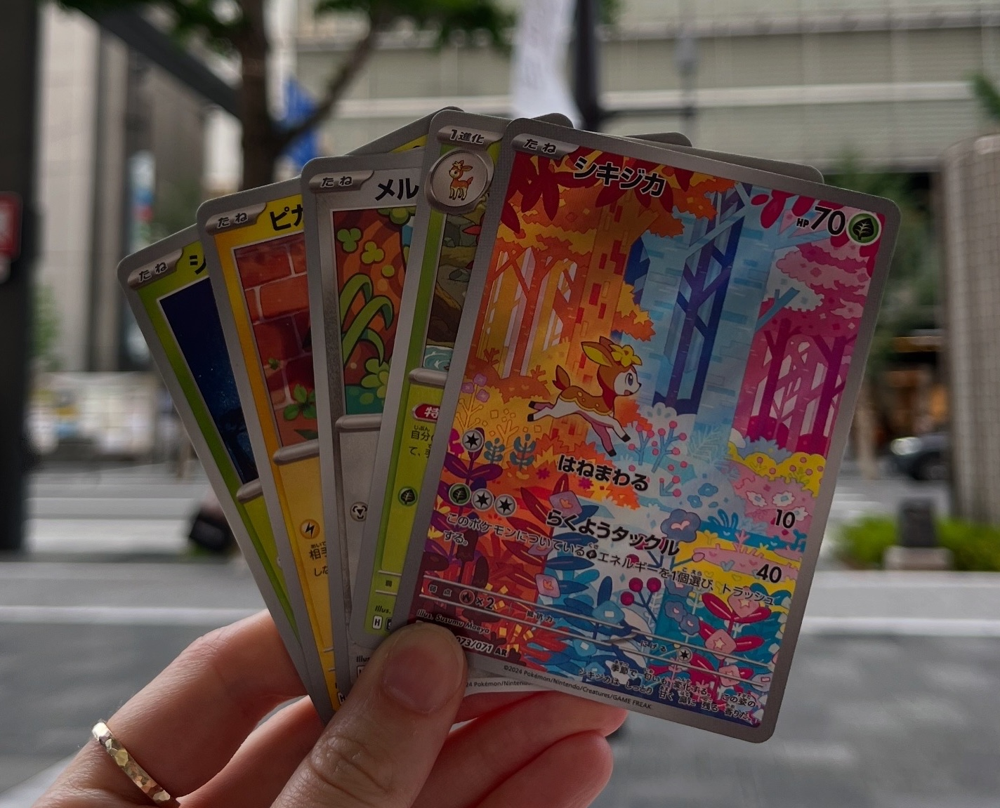

{fig-align="center" width="500"}

In an age where the average person needs to watch a 30 second TikTok video at 2x speed to stay engaged (*or maybe that's just me*), it's getting more and more difficult to keep an 80 minute class interesting for students.

Utilizing popular culture references and examples is one of the ways I've been able to engage students with course materials, particularly in large classrooms. As a statistician, we are often talking about probabilities and sampling. The "easy" examples? Rolling a dice. Drawing a card from a desk. Pulling a ball out of an urn. While intuitive, these examples are not particularly engaging, and can get repetitive very quickly. When thinking about real life examples of probability and sampling for my first year data science lecture on sampling and bootstrapping, a light bulb went off. A regular deck of cards? Boring (for most). A deck of **Pokemon** cards? There could be potential here.

I'll admit - my partner and I do have a large collection of Pokemon cards that inspired this idea, which started on our trip to Japan in 2025. I collected them as a kid (my mom donated my collection 🤡) and the nostalgia got to me on the trip. When I was sorting through my "bulk" cards (cards that weren't necessarily worthy of sleeving/keeping), I realized how easily these could be incorporated into all sorts of statistics lectures. Pokemon have both numeric values (HP, attack power) and categorical values (Pokemon/trainer/energy, elemental type, rarity, hollow status) associated with them. This allows us to be flexible with the types of concepts we'd like to explore using the cards.

I originally was going to rip some packs in a lecture involving sampling, but I couldn't find enough fresh packs locally to open. Instead, I decided to bring 100 unique Pokemon cards to lecture to demonstrate bootstrapping and resampling! I calculated the population average of the 100 Pokemon's HPs prior to class. I had ten students select a card randomly, which was our random sampling. Then, using the document camera I performed the resampling procedure. I chose a card, recorded the HP, and then replaced the card and shuffled the deck (10 times). We then used the ten recorded HPs to calculate the bootstrap mean for one bootstrap sample. I repeated this process a few more times to begin to create the bootstrap distribution.

In this demo, students were able to see that resampling meant that the same observation (Pokemon) could be selected multiple times. In a given bootstrap sample, we saw Snorlax appear multiple times. I emphasized that this was okay, and expected, in a bootstrap sample.

I have never seen my class so excited/engaged. There were multiple people recording the lecture (not my *favourite* thing ever, but I let my no recording policy slide for this one), lots of laughs, and so much **energy** in the classroom. It sparked a lot of great conversations with the students after class, and my course evaluations mentioned the use of Pokemon cards (positively!) quite a few times.

There are certainly more ways one could use physical Pokemon cards in lecture! The bootstrapping lecture was just one way that I found it natural to incorporate the cards into. I plan to incorporate them into my probability theory lectures this term, as rolling a dice is only so exciting. I now keep a stack of bulk cards in my office for when the inspiration strikes.

*Does this mean I can buy Pokemon cards and use my education funds?* 🤔
