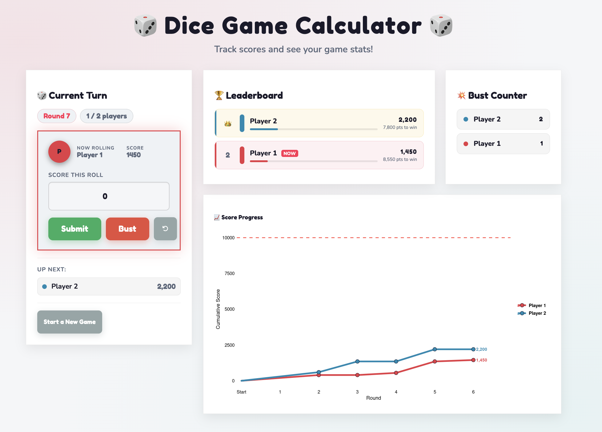

{fig-align="center"}

An RShiny app developed to score and view stats of a dice game that my family plays. We call it "the dice game". Origins unknown. Rules can be found in the app! 

Mostly vibe-coded with Claude. 

Shiny App: <https://grcetmpk.shinyapps.io/dicegamecalculator/>

GitHub Repository: <https://github.com/grcetmpk/dicegamecalculator>
